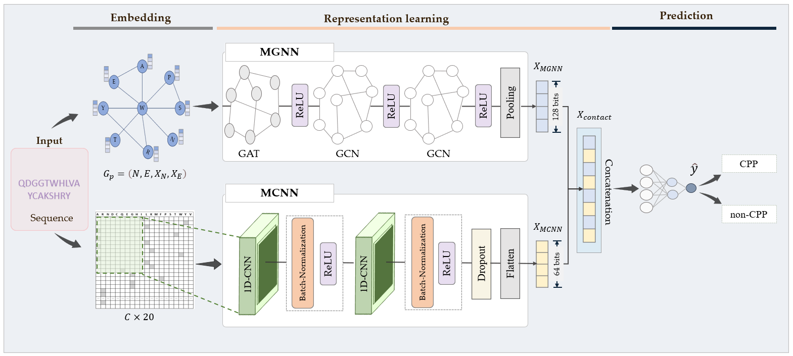

# DeepCPP: A deep learning-based framework for enhanced prediction of cell penetrating peptides

Cell-penetrating peptides (CPPs) are bioactive molecules characterized by a positive charge, primarily attributed to lysine, arginine, or histidine residues, which enable their traversal across cells’ lipid bilayer membranes. This unique property positions CPPs as promising candidates for intracellular delivery of therapeutic agents. The expanding database of experimentally validated CPPs has facilitated significant advancements in computational modeling, enabling in-silico prediction and engineering of established and novel CPPs. Despite progress in this domain, challenges persist in improving the performance of CPP prediction models. This study introduces DeepCPP, a new deep learning-based framework for efficient CPP prediction. DeepCPP employs a multi-head information fusion approach that integrates a multilayer convolutional neural network (MCNN)-guided encoder with a multilayer graph neural network (MGNN)-guided encoder to jointly learn evolutionary, connectivity, chemical, and structural features through evolutionary information-based and graph-based representations. Comprehensive experiments conducted on established benchmark datasets reveal the effectiveness of the DeepCPP model, exhibiting performance superior to state-of-the-art models in CPP prediction. To promote broader accessibility, we provide a user-friendly web service for the proposed DeepCPP model, accessible at https://deepcpp.streamlit.app/. 



## Setup Environment

 
  * Clone the repository: `git clone https://github.com/Soualihou237/DeepCPP.git`
  * Installed required libraries: `conda env create -f environment.yml`## Setup Environment

## Usage


### File description
1. `Trained_model:` The directory where the trained model is saved. 
2. `Data:` The directory containing data for testing purposes.
 	- `test.fasta`: The sample of the test dataset(.fasta).
3.  The source code for `DeepCPP`.
 	- `dataprocessing.py`: code for peptide sequence embedding
 	- `cppprediction.py`: code for performing prediction

## Getting started
### Cloning this repository
```
git clone https://github.com/Soualihou237/DeepCPP.git
```
```
cd DeepCPP-main
```
### Running prediction from fasta file
#### Usage
```
>> python cppprediction.py Data/test.fasta

```
#### Output sample:

```txt
  ID: seq_1, sequence: RLWMRWYSPTTRARG, score: 0.9959668, class: CPP
  ID: seq_2, sequence: QDGGTWHLVAYCAKSHRY, score: 0.9401595, class: CPP
  ID: seq_3, sequence: WWWRRRRRRRR, score: 0.9996586, class: CPP
  ID: seq_4, sequence: KLLKLLLKLLLKLLKX, score: 0, class: Invalid code - 4
```
  
 * Output explaination:
   - `ID` Represents the identifier of the peptide sequence as specified in the FASTA file.
   - `sequence` The peptide sequence extracted from the FASTA file, which is analyzed for its properties.
   - `score` => A numeric value ranging between 0 and 1, indicating the likelihood of the peptide being a CPP. A higher score suggests a stronger likelihood.
   - `class` => Specifies the classification of the peptide as either:
      - `CPP`: Cell-penetrating peptide.
      - `Non-CPP`: Not a cell-penetrating peptide.
   ##### Invalid Peptide Sequences
     If the peptide sequence is invalid, the output will specify the reason for invalidity under the `class` field and its `score` will be `0`. The types of invalidity are as follows:
     - `Invalid-1` The peptide sequence does not meet the required length criteria and contains non-valid residues.
     - `Invalid-2` The peptide sequence does not meet the required length criteria but contains valid residues.
     - `Invalid-3` The peptide sequence meets the required length criteria but contains non-valid residues.

#### Reference (please cite the following paper if you use the present code):
[1]. not yet available
